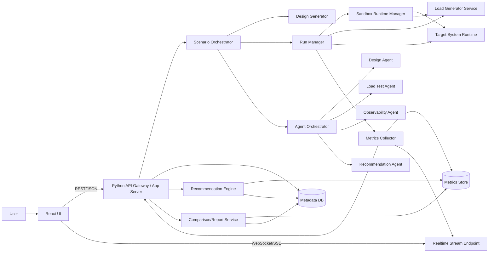
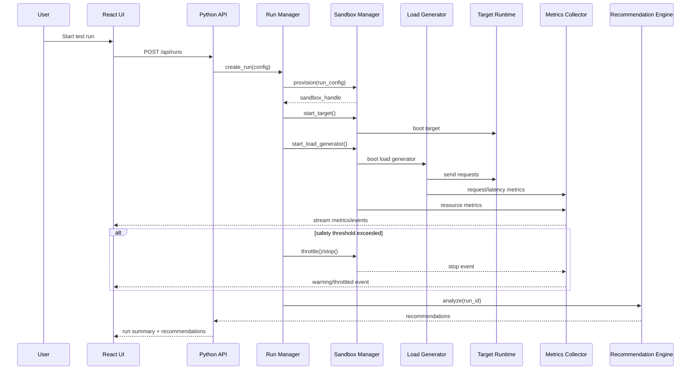

# Concrete Architecture: System Design Learning & Load Analysis Platform

## 1. Purpose

Define a concrete architecture for implementing the platform in `docs/requirements.md`, including component boundaries, runtime interactions, and interface contracts.

## 2. Technology Direction (Concrete Baseline)

- Backend/API/Orchestration: `Python` (FastAPI recommended)
- Frontend UI: `React` (Vite + React + charting library)
- Metrics transport: WebSocket/SSE for live updates
- Persistence: relational DB for metadata + time-series store (or relational for MVP)
- Sandbox runtime: pluggable runtime manager (container/process-based)
- Load generator: Python service with profile executor

This is a baseline, not a lock-in decision.

## 3. High-Level Component Diagram



## 4. Deployment View (Local MVP)

Primary local deployment processes:

- `frontend` (React dev server / static app)
- `backend-api` (FastAPI app)
- `load-generator` (may run as a child process or sidecar service)
- `sandbox-runtime-manager` (can be library/module in backend for MVP)
- `metrics-collector` (embedded in backend for MVP)
- `target-runtime` (mock/prototype app under sandbox constraints)

MVP simplification:

- `metrics store` can start as relational tables + in-memory buffering.
- `agent orchestrator` can run in-process with async tasks.

## 5. Core Runtime Flows

### 5.1 Scenario Creation and Design Generation

1. User creates `Project` and `Scenario` in UI.
2. UI sends requirements to API.
3. API stores `RequirementSet`.
4. `Scenario Orchestrator` invokes `Design Generator`.
5. Design Generator returns one or more `ArchitectureVariant` proposals with assumptions.
6. API persists results and returns to UI.

### 5.2 Load Test Execution

1. User selects scenario + variant + load profile.
2. API validates inputs against safety policies.
3. `Run Manager` requests sandbox allocation from `Sandbox Runtime Manager`.
4. Sandbox starts target runtime and load generator with resource limits.
5. `Load Generator Service` executes load profile against target endpoint.
6. `Metrics Collector` streams metrics to:
   - realtime stream endpoint (UI)
   - metrics store
   - run status tracking
7. If thresholds are exceeded, `Run Manager` throttles/stops run and records reason.
8. Run completes; summary stored.

### 5.3 Post-Test Analysis and Recommendation

1. `Recommendation Engine` reads test metrics + run context.
2. Bottlenecks are inferred (CPU saturation, memory pressure, queueing, high read latency, etc.).
3. Engine emits ranked `Recommendation` entries with rationale/tradeoffs.
4. API exposes results to UI.
5. User optionally applies a recommendation and creates a new variant/run.

## 6. Component Responsibilities

### 6.1 React UI

Major screens:

- Scenario Builder
- Architecture Variant Viewer
- Run Configuration / Launch
- Live Monitoring Dashboard
- Results & Recommendations
- Comparison Report
- Agent Activity (Phase 3)

Responsibilities:

- Form validation (basic UX-level validation)
- Live chart rendering
- Run status visualization
- Manual emergency stop action
- Comparison diff display

### 6.2 Python API Gateway / App Server

Responsibilities:

- Authentication (future; optional for local MVP)
- Project/scenario CRUD
- Request validation and schema enforcement
- Orchestration entrypoints
- Realtime stream endpoint for UI
- Result/report retrieval

Recommended modules:

- `api/routes/projects.py`
- `api/routes/scenarios.py`
- `api/routes/runs.py`
- `api/routes/recommendations.py`
- `api/routes/reports.py`
- `core/orchestrator.py`
- `core/policies.py`

### 6.3 Scenario Orchestrator

Responsibilities:

- Coordinates design generation, test execution, and analysis workflow
- Tracks state transitions
- Invokes agent orchestration when enabled
- Persists artifacts and run metadata

State machine (simplified):

- `draft`
- `designed`
- `run_queued`
- `run_provisioning`
- `running`
- `throttled`
- `stopped`
- `completed`
- `failed`
- `analyzed`

### 6.4 Design Generator

Responsibilities:

- Transform requirement set into architecture variants
- Capture assumptions and tradeoffs
- Produce machine-readable component graphs + human-readable rationale

Implementation approach (MVP):

- Template + rule engine
- Optional agent-assisted narrative explanations

### 6.5 Run Manager

Responsibilities:

- Run lifecycle management
- Coordination with sandbox manager, load generator, metrics collector
- Threshold enforcement and emergency stop handling
- Run status updates and event emission

### 6.6 Sandbox Runtime Manager

Responsibilities:

- Allocate and configure constrained runtime for target and load generator
- Apply CPU/memory limits
- Enforce max test duration
- Cleanup resources after run

Interface requirement:

- Must abstract underlying implementation to support multiple backends:
  - local process-limited mode
  - containerized mode
  - simulation-only mode

### 6.7 Load Generator Service

Responsibilities:

- Execute load profiles (constant/ramp/spike/step/soak)
- Produce request-level and aggregate metrics
- Respect throttle/stop commands from Run Manager

Key outputs:

- request success/failure counts
- latency histograms/percentiles
- throughput
- retries/timeouts

### 6.8 Metrics Collector and Store

Responsibilities:

- Collect metrics from:
  - target runtime
  - load generator
  - sandbox/host telemetry
- Normalize and timestamp metrics
- Persist metric series and serve queries
- Stream near-real-time updates to UI

MVP note:

- A single collector process with an append-only metric table is sufficient initially.

### 6.9 Recommendation Engine

Responsibilities:

- Analyze bottlenecks using metric-driven rules
- Generate prioritized recommendations
- Include tradeoffs, consistency implications, and “when not to use”

Recommended architecture:

- `finding detectors` (CPU-bound, memory-bound, DB-latency-bound, etc.)
- `recommendation rules` (cache, queue, index, gateway, partitioning)
- `ranking policy` (impact vs complexity)

### 6.10 Agent Orchestrator (Phase 3)

Responsibilities:

- Route tasks to specialized agents
- Execute selected tasks in parallel where safe
- Collect outputs with provenance
- Resolve conflicts and generate merged results

## 7. Interface Contracts (API)

The following are concrete interface proposals for MVP and near-term phases.

### 7.1 REST Endpoints (MVP)

#### Projects & Scenarios

- `POST /api/projects`
- `GET /api/projects`
- `GET /api/projects/{project_id}`
- `POST /api/projects/{project_id}/scenarios`
- `GET /api/scenarios/{scenario_id}`
- `PUT /api/scenarios/{scenario_id}`

#### Requirements & Design Generation

- `POST /api/scenarios/{scenario_id}/requirements`
- `POST /api/scenarios/{scenario_id}/designs:generate`
- `GET /api/scenarios/{scenario_id}/variants`
- `GET /api/variants/{variant_id}`

#### Runs

- `POST /api/runs`
- `GET /api/runs/{run_id}`
- `POST /api/runs/{run_id}/stop`
- `GET /api/runs/{run_id}/metrics`
- `GET /api/runs/{run_id}/events`

#### Analysis / Recommendations / Reports

- `POST /api/runs/{run_id}/analyze`
- `GET /api/runs/{run_id}/recommendations`
- `POST /api/recommendations/{recommendation_id}/apply`
- `GET /api/scenarios/{scenario_id}/comparisons`
- `GET /api/reports/{report_id}`

### 7.2 Example Request/Response Schemas

#### `POST /api/runs` request

```json
{
  "scenario_id": "scn_123",
  "variant_id": "var_456",
  "load_profile": {
    "type": "ramp",
    "duration_sec": 300,
    "start_rps": 50,
    "end_rps": 1000,
    "concurrency": 200,
    "request_mix": {
      "read": 0.8,
      "write": 0.2
    }
  },
  "sandbox_profile": "medium",
  "safety_overrides": {
    "max_cpu_pct": 85,
    "max_memory_mb": 2048
  }
}
```

#### `POST /api/runs` response

```json
{
  "run_id": "run_789",
  "status": "run_queued",
  "created_at": "2026-02-23T12:00:00Z"
}
```

#### `GET /api/runs/{run_id}` response (partial)

```json
{
  "run_id": "run_789",
  "status": "running",
  "phase": "load_execution",
  "sandbox": {
    "profile": "medium",
    "limits": {
      "cpu_cores": 2,
      "memory_mb": 2048
    }
  },
  "safety": {
    "throttled": false,
    "stop_reason": null
  }
}
```

### 7.3 Realtime Stream Interface

Recommended transport:

- WebSocket for bidirectional control + metrics
- SSE acceptable for MVP if control messages remain REST-based

WebSocket channel example:

- `GET /api/runs/{run_id}/stream` (upgrade to WS)

Event types:

- `run.status_changed`
- `run.warning`
- `run.throttled`
- `run.completed`
- `metric.sample`
- `metric.aggregate`
- `recommendation.generated`

Example `metric.aggregate` payload:

```json
{
  "type": "metric.aggregate",
  "run_id": "run_789",
  "timestamp": "2026-02-23T12:01:10Z",
  "metrics": {
    "rps": 740,
    "latency_ms": {
      "p50": 42,
      "p95": 130,
      "p99": 280
    },
    "error_rate": 0.018,
    "cpu_pct": 79,
    "memory_mb": 1580
  }
}
```

## 8. Internal Service Interfaces (Python)

Define these as Python protocols/abstract base classes to keep implementations replaceable.

### 8.1 `SandboxRuntimeBackend`

```python
class SandboxRuntimeBackend(Protocol):
    def provision(self, run_config: RunConfig) -> SandboxHandle: ...
    def start_target(self, handle: SandboxHandle, target_spec: TargetSpec) -> None: ...
    def start_load_generator(self, handle: SandboxHandle, load_spec: LoadSpec) -> None: ...
    def throttle(self, handle: SandboxHandle, policy: ThrottlePolicy) -> None: ...
    def stop(self, handle: SandboxHandle, reason: str) -> None: ...
    def cleanup(self, handle: SandboxHandle) -> None: ...
    def get_limits(self, handle: SandboxHandle) -> ResourceLimits: ...
```

### 8.2 `LoadGeneratorEngine`

```python
class LoadGeneratorEngine(Protocol):
    def validate_profile(self, profile: LoadProfile) -> ValidationResult: ...
    def start(self, run_id: str, target: TargetEndpoint, profile: LoadProfile) -> None: ...
    def stop(self, run_id: str) -> None: ...
    def get_status(self, run_id: str) -> LoadStatus: ...
```

### 8.3 `MetricsSink` / `MetricsCollector`

```python
class MetricsSink(Protocol):
    def write_samples(self, run_id: str, samples: list[MetricSample]) -> None: ...
    def write_event(self, run_id: str, event: RunEvent) -> None: ...

class MetricsQueryService(Protocol):
    def query_series(self, run_id: str, metric_names: list[str], start_ts: datetime, end_ts: datetime) -> MetricQueryResult: ...
    def summarize(self, run_id: str) -> RunMetricSummary: ...
```

### 8.4 `RecommendationProvider`

```python
class RecommendationProvider(Protocol):
    def detect_findings(self, run: TestRunContext, metrics: RunMetricSummary) -> list[BottleneckFinding]: ...
    def recommend(self, run: TestRunContext, findings: list[BottleneckFinding]) -> list[Recommendation]: ...
```

## 9. Data Contracts (Conceptual Tables / Collections)

MVP core tables/collections:

- `projects`
- `scenarios`
- `requirement_sets`
- `architecture_variants`
- `test_runs`
- `load_profiles`
- `run_events`
- `metric_samples` (or bucketed aggregates)
- `bottleneck_findings`
- `recommendations`
- `comparison_reports`
- `agent_task_results` (Phase 3)

Key relationship notes:

- A `scenario` has many `requirement_sets`
- A `scenario` has many `architecture_variants`
- A `variant` has many `test_runs`
- A `test_run` has many `metric_samples`, `run_events`, `recommendations`

## 10. Safety Controls (Concrete Enforcement Points)

- API validation:
  - reject impossible/unsafe load configs
  - cap concurrency and duration by sandbox profile
- Run Manager:
  - hard max runtime timeout
  - safety thresholds for CPU/memory/error rate
- Sandbox Manager:
  - resource limits
  - isolated process/container cleanup
- UI:
  - warnings before high-intensity runs
  - emergency stop button

## 11. Observability Dashboard Widget Set (MVP)

Required widgets:

- Run status timeline
- RPS line chart
- Latency percentile chart (p50/p95/p99)
- Error rate chart
- CPU usage chart
- Memory usage chart
- Event/warning log panel
- Summary cards (current RPS, p95, errors, CPU, memory)

## 12. Sequence Diagram (Run Lifecycle)



## 13. Incremental Implementation Notes

- Start with a single-process backend containing:
  - API routes
  - run manager
  - metrics collector
  - recommendation engine
- Extract services only when complexity justifies it.
- Keep interfaces explicit from day one so extraction is low-friction.

## 14. Open Architecture Decisions

- Which sandbox backend is most reliable for local Windows-first operation?
- WebSocket vs SSE for MVP realtime updates?
- Time-series storage choice for local simplicity vs future scale?
- How much of target system behavior is simulated vs executable prototype in MVP?
